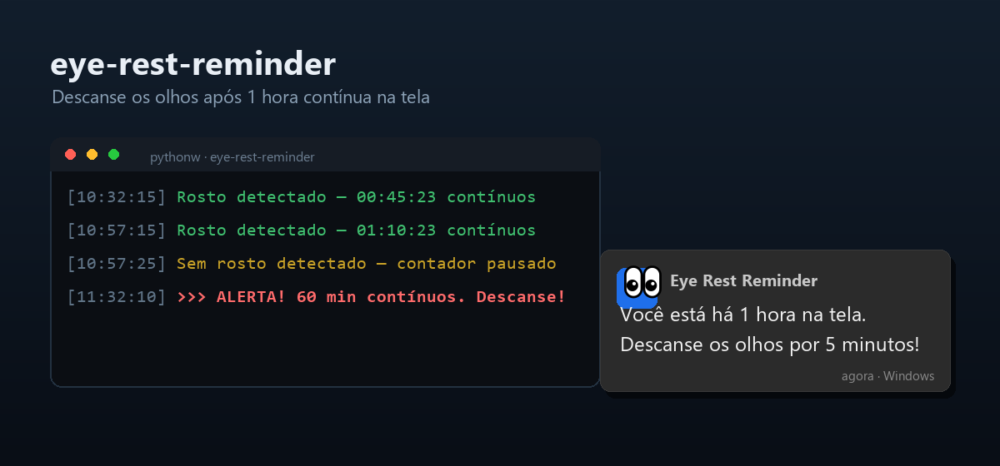

# 👀 eye-rest-reminder


Aplicação Python que monitora sua webcam e avisa para **descansar os olhos**
após **1 hora contínua** em frente ao computador.

Usa detecção de rosto na webcam para saber se você está à frente do PC,
conta o tempo contínuo de uso e dispara uma **notificação nativa do Windows**
+ **som de alerta** quando você passa do limite.



---

## 🔒 Privacidade

Todo o processamento é **100% local, na sua máquina**. A aplicação apenas lê o
frame da webcam na memória, roda a detecção e o descarta. **Nenhuma imagem é
salva em disco, e nada é enviado para a internet.** Não há servidores, telemetria
ou upload de qualquer tipo.

---

## Como funciona

- Captura um frame da webcam a cada 10 segundos (ajustável).
- Detecta se há um **rosto** no frame.
- Conta o tempo **contínuo** em que você está detectado.
- Ao atingir **60 minutos contínuos** → dispara o alerta.
- Se você sumir por mais de **2 minutos** → o contador é **zerado**
  (considera que você saiu).
- Após um alerta, aguarda **10 minutos** antes de poder alertar de novo.

### 🖐️ Bônus: alerta de "mão na cabeça" (opcional)

Além do lembrete de descanso, a app pode te avisar sempre que você levar a
**mão à cabeça** — útil, por exemplo, pra quebrar a mania de ficar coçando a
cabeça. Usa o **MediaPipe** (Google) para achar os pontos do corpo (mãos +
cabeça) e detecta quando uma mão sobe até perto da cabeça.

- Ligado/desligado por `ENABLE_HAND_ON_HEAD` em [config.py](config.py).
- **Anti-falso-positivo:** ao detectar a mão, ele **confirma por alguns
  segundos** (`HAND_ON_HEAD_CONFIRM_SECONDS`, padrão 4 s) antes de avisar. Se a
  mão sair nesse meio-tempo, ignora — assim uma coçada rápida ou ajeitar o
  óculos **não** dispara o alerta; só um gesto sustentado dispara.
- Tem um *cooldown* (`HAND_ON_HEAD_COOLDOWN_SECONDS`, padrão 60 s) pra não
  repetir o aviso a cada verificação enquanto a mão continua lá.
- Também roda **100% local**. Baixa um modelo de ~5 MB na primeira execução.
- Se o `mediapipe` não estiver instalado, o recurso simplesmente se desativa
  (sem derrubar a app) — o lembrete de descanso continua normal.

### 😴 Descanso por olhos fechados (opcional)

Se você **fechar os olhos por um tempo** (descanso real, cochilo), a app
considera isso um descanso e **zera o contador de tempo de tela** — afinal,
com os olhos fechados você não está forçando a vista.

- Usa o **MediaPipe Face Landmarker** (blendshapes `eyeBlink`) para saber se os
  olhos estão fechados. Roda **100% local** (modelo de ~3 MB baixado na 1ª vez).
- Ligado/desligado por `ENABLE_EYES_CLOSED_REST` em [config.py](config.py).
- Só conta como descanso se os olhos ficarem fechados por
  `EYES_CLOSED_REST_SECONDS` (padrão 30 s) **contínuos** — um piscar normal
  nunca chega perto disso.
- O limiar `EYE_CLOSED_THRESHOLD` (padrão 0.45) define a partir de que ponto o
  olho é considerado fechado. Se não estiver disparando, tente abaixá-lo (ex.:
  0.4); se disparar à toa, aumente.

### Detector: Haar (padrão) ou YOLO

Por padrão a app usa o **Haar Cascade do OpenCV** para detecção de rosto — é
**leve, não baixa nada** (já vem no `opencv-python`) e usa quase nenhuma CPU.
Ideal para rodar o dia inteiro em segundo plano.

Se preferir, existe um backend alternativo com **YOLOv8n** (detecta *pessoa*,
mais robusto, porém exige instalar o PyTorch, ~2,5 GB). Para trocar, edite
`DETECTOR` em [config.py](config.py) para `"yolo"` e instale:
`pip install ultralytics`.

---

## Requisitos

- **Windows** (para webcam e notificações nativas — **não** rodar no WSL).
- **Python 3.10+**

---

## Instalação

Abra o **PowerShell** (ou Prompt de Comando) na pasta do projeto e rode:

```powershell
# 1. (Recomendado) crie e ative um ambiente virtual
python -m venv venv
.\venv\Scripts\activate

# 2. Instale as dependências
pip install -r requirements.txt
```

> Com o detector padrão (Haar), **não há downloads adicionais** — o classificador
> já vem embutido no `opencv-python`. Basta instalar o `requirements.txt`.

---

## Execução

```powershell
python main.py
```

Para **parar**, pressione `Ctrl+C`.

---

## Log em tempo real

O terminal exibe o status a cada verificação (a cada 10 s por padrão):

```
[10:32:15] Rosto detectado — 00:45:23 contínuos
[10:32:16] Sem rosto detectado — contador pausado
...
[11:32:10] >>> ALERTA! 60 min contínuos atingidos. Descanse os olhos!
```

Quando o alerta dispara, você recebe:

- 🔔 **Notificação popup** do Windows.
- 🔊 **Som de alerta** (beep, ou um `.wav` se você configurar).
- Mensagem: *"👀 Você está há 1 hora na tela. Descanse os olhos por 5 minutos!"*

---

## Configuração

Todas as constantes ficam em [config.py](config.py) e são fáceis de ajustar:

| Constante | Padrão | Descrição |
|---|---|---|
| `ALERT_AFTER_MINUTES` | `60` | Minutos contínuos até o alerta |
| `RESET_AFTER_SECONDS` | `120` | Segundos sem rosto para zerar o contador |
| `ENABLE_EYES_CLOSED_REST` | `True` | Trata olhos fechados por um tempo como descanso |
| `EYES_CLOSED_REST_SECONDS` | `30` | Segundos de olhos fechados que contam como descanso |
| `EYE_CLOSED_THRESHOLD` | `0.45` | Limiar do blendshape para considerar o olho fechado |
| `COOLDOWN_AFTER_ALERT_MINUTES` | `10` | Espera antes de poder alertar de novo |
| `WEBCAM_INDEX` | `0` | Índice da webcam (0 = padrão) |
| `ENABLE_HAND_ON_HEAD` | `True` | Liga o alerta de "mão na cabeça" (requer mediapipe) |
| `HAND_ON_HEAD_CONFIRM_SECONDS` | `4` | Confirma que a mão continua lá antes de avisar (filtra coçada rápida) |
| `HAND_ON_HEAD_COOLDOWN_SECONDS` | `60` | Espera entre alertas de "mão na cabeça" |
| `DETECTOR` | `"haar"` | Backend de detecção: `"haar"` (leve) ou `"yolo"` |
| `YOLO_MODEL` | `yolov8n.pt` | Modelo usado quando `DETECTOR = "yolo"` |
| `DETECTION_CONFIDENCE` | `0.4` | Confiança mínima (usada só no YOLO) |
| `FRAME_INTERVAL_SECONDS` | `10.0` | Intervalo entre verificações (segundos) |
| `ALERT_WAV_FILE` | `None` | Caminho de um `.wav` de alerta (opcional) |

---

## Estrutura de arquivos

```
eye-rest-reminder/
  main.py                  ← loop principal
  detector.py              ← detecção de rosto (Haar) ou pessoa (YOLO)
  gesture.py               ← detecção de "mão na cabeça" (MediaPipe)
  eyes.py                  ← detecção de "olhos fechados" (MediaPipe)
  notifier.py              ← notificação Windows + som
  config.py                ← constantes configuráveis
  test_smoke.py            ← teste rápido de webcam + detector
  iniciar.bat              ← atalho: inicia mostrando o log
  iniciar-silencioso.vbs   ← atalho: inicia em segundo plano (sem janela)
  requirements.txt
  README.md
```

---

## Atalhos de inicialização

- **[iniciar.bat](iniciar.bat)** — duplo clique abre uma janela com o **log em
  tempo real**. Para parar, feche a janela ou `Ctrl+C`.
- **[iniciar-silencioso.vbs](iniciar-silencioso.vbs)** — duplo clique inicia em
  **segundo plano, sem janela** (via `pythonw`). Para parar: Gerenciador de
  Tarefas (`Ctrl+Shift+Esc`) → aba **Detalhes** → finalizar `pythonw.exe`.

### Iniciar junto com o Windows (opcional)

Para que o app suba sozinho ao ligar o computador:

1. Pressione `Win + R`, digite `shell:startup` e Enter — abre a pasta de
   Inicialização.
2. Crie ali um **atalho** para o `iniciar-silencioso.vbs` (clique com o botão
   direito no `.vbs` → *Enviar para* → *Área de trabalho*, depois mova o atalho
   para a pasta de Inicialização — ou arraste com o botão direito e escolha
   *Criar atalhos aqui*).

Para desativar depois, apague esse atalho da pasta `shell:startup` (ou use o
Gerenciador de Tarefas → aba **Aplicativos de inicialização**).

---

## Solução de problemas

- **"não foi possível abrir a webcam"** — verifique se a webcam está conectada
  e se nenhum outro programa (Zoom, Teams, etc.) está usando-a. Tente outro
  valor em `WEBCAM_INDEX` (0, 1, 2...).
- **Notificação não aparece** — o Windows pode estar em modo "Não perturbe" /
  "Assistente de foco". Verifique também as permissões de notificação do app.
- **Sem som** — confirme o volume do sistema; ou configure um arquivo `.wav`
  em `ALERT_WAV_FILE`.

---

## Licença

Distribuído sob a licença **MIT** — veja o arquivo [LICENSE](LICENSE).
